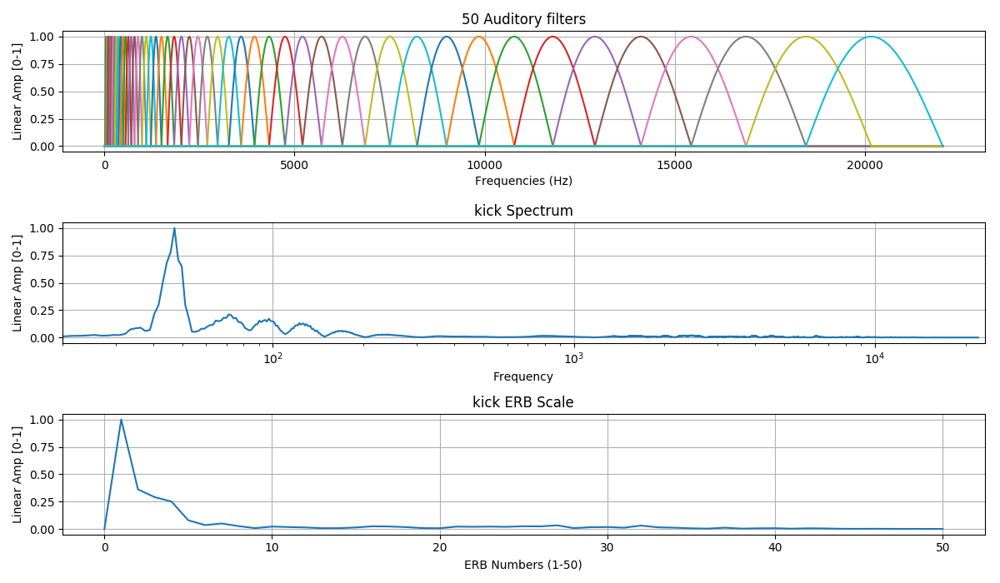
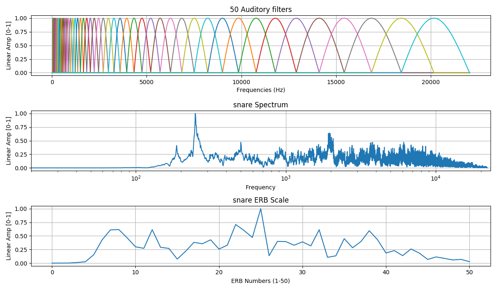
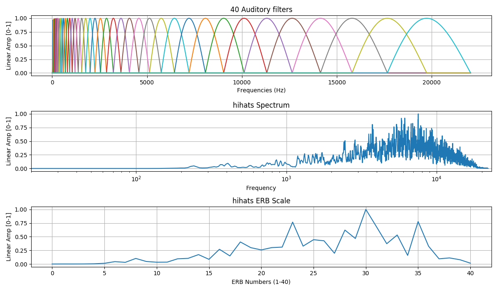

# erb_bands
ERB representation of an audio file implemented in Python.

## Description
An audio file decomposed in samples after STFT and it is represented in (user-defined) ERB bands.
This implementatio does not use a complete auditory model.

The main ideas, code and concepts to read the wav files and perform the STFT is taken from Ajin Tom in his repo:
https://github.com/ajintom/auto-spatial </br>
On the other hand, the main ideas, code and concepts to build the ERB bands is taken from William J. Wilkinson in his repo:
https://github.com/wil-j-wil/py_bank

## Table of Contents

- [Requirements](#requirements)
- [Usage](#usage)
- [Examples](#examples)
- [License](#license)

## Requirements
Tested with Python 2.7 on MacOS 10.13.2 High Sierra 64-bits). 

## Usage
```bash
$ python main.py
```

## Examples

kick.wav </br>
Samples: 32768 </br>
ERB bands: 50 </br>


snare.wav </br>
Samples: 32768 </br>
ERB bands: 20 </br>


hihats.wav </br>
Samples: 4000 </br>
ERB bands: 40 </br>



## License

This project is licensed under the MIT License - see the [LICENSE](LICENSE) file for details
